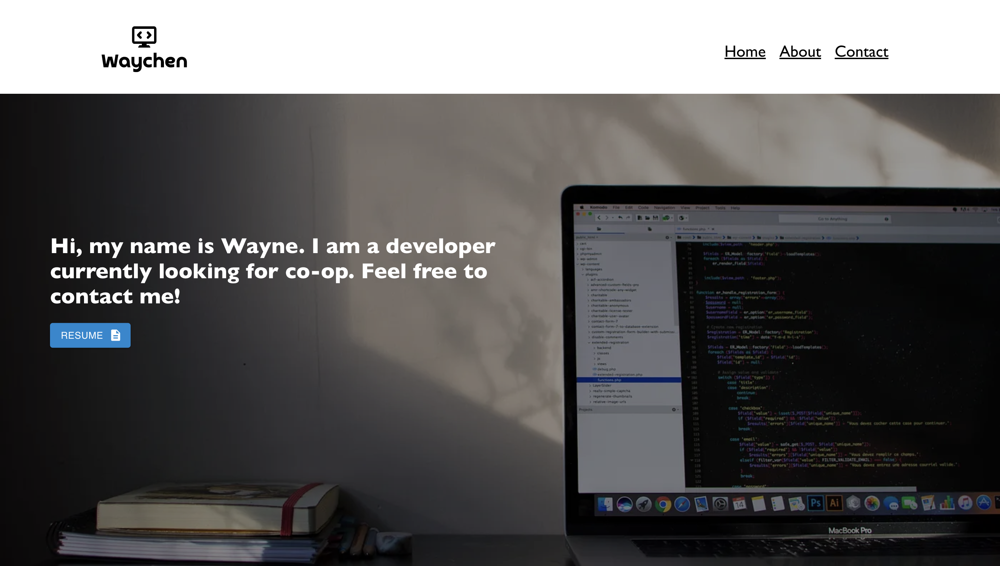
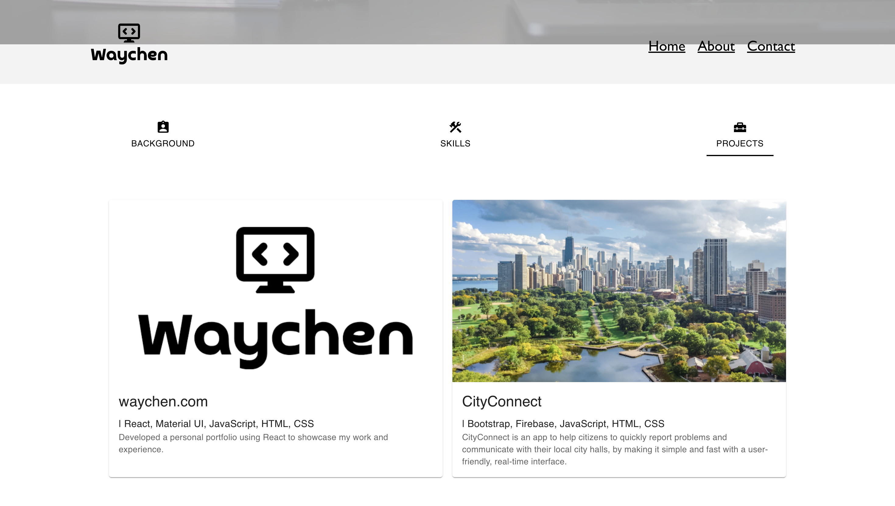

# Personal Portfolio Website

## Overview

This is the source code for my personal portfolio website built using React. The website showcases my skills, projects, and provides information about me. The project structure includes components for the navbar, home page, and about page.

## Home Page



## Project



# Getting Started

This guide will walk you through the process of setting up and running a React application on your local machine.

## Prerequisites

Before you begin, ensure you have the following installed on your system:

- Node.js & npm: Node.js is a JavaScript runtime, and npm is its package manager. You can download and install them from [nodejs.org](https://nodejs.org).
- Git: Git is a version control system. You can download and install it from [git-scm.com](https://git-scm.com).

## Installation

1. Clone the repository to your local machine using Git:

   ```bash
   git clone <repository-url>
   ```

2. Navigate to the project directory:

   ```bash
   cd <project-directory>
   ```

3. Install dependencies using npm:

   ```bash
   npm install
   ```

## Available Scripts

In the project directory, you can run the following commands:

### `npm start`

Runs the app in development mode.
Open [http://localhost:3000](http://localhost:3000) to view it in the browser.

The page will reload if you make edits.
You will also see any lint errors in the console.

### `npm test`

Launches the test runner in the interactive watch mode.
See the section about [running tests](https://facebook.github.io/create-react-app/docs/running-tests) for more information.

### `npm run build`

Builds the app for production to the `build` folder.
It correctly bundles React in production mode and optimizes the build for the best performance.
The build is minified and the filenames include the hashes.

Your app is ready to be deployed!

## Learn More

You can learn more about React by visiting the [React documentation](https://reactjs.org/).
To learn React, check out the [React documentation](https://reactjs.org/docs/getting-started.html).
You can also check out the [Create React App documentation](https://facebook.github.io/create-react-app/docs/getting-started).

## License

This project is licensed under the terms of the MIT license.
